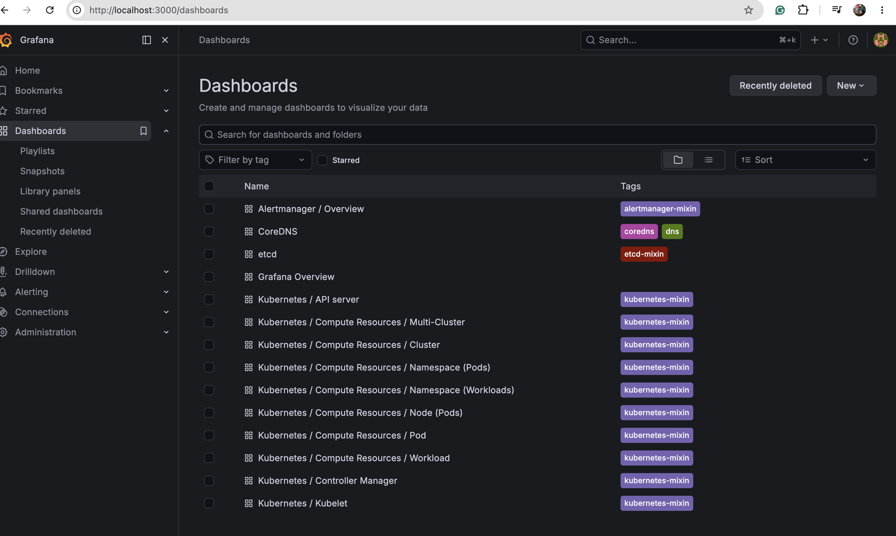
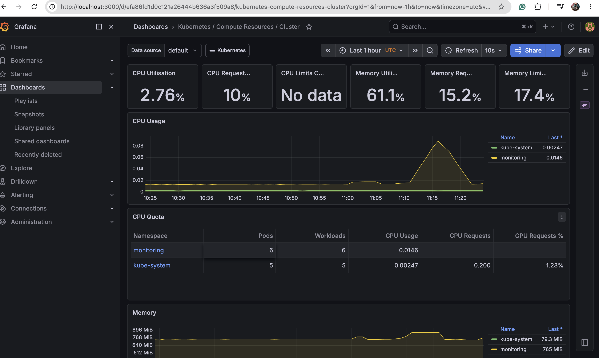

# Kubernetes AI Troubleshooting Agent

An AI-powered Kubernetes agent that automatically detects unhealthy pods and uses Google Gemini to diagnose root causes and recommend fixes.

## Features
- Detects unhealthy/crashing pods automatically
- Collects pod logs, events, and exit codes
- Uses Google Gemini AI for root cause analysis
- Recommends fixes like a Senior SRE

## Tech Stack
- **Python** - Agent logic
- **Kubernetes** - Container orchestration (k3d)
- **Google Gemini AI** - Pod diagnosis
- **Docker** - Containerization
- **ArgoCD** - GitOps continuous deployment
- **Prometheus + Grafana** - Cluster monitoring
- **Terraform** - Infrastructure as code
- **Azure VM** - Cloud hosting

## Architecture
Azure VM
↓
k3d Kubernetes Cluster
↓
ArgoCD (GitOps deployment)
↓
Python AI Agent
↓
Collect Events + Logs + Exit Codes
↓
Google Gemini AI
↓
Root Cause Analysis + Fix Recommendations

## Setup

1. Install dependencies:
```bash
pip install -r requirements.txt
```

2. Create `.env` file:
GEMINI_API_KEY=your_api_key

3. Run:
```bash
python agent.py
```

## Example Output
The agent detects a CrashLoopBackOff pod and returns:
- Issue Type
- Root Cause
- Impact
- Recommended Fix

## Future Improvements
- Multi-namespace support
- Slack alerts integration
- Automated remediation
- Streamlit dashboard

## Screenshots

### Grafana Monitoring Dashboard


## Screenshots

### Grafana Monitoring Dashboard


### Kubernetes Dashboard

